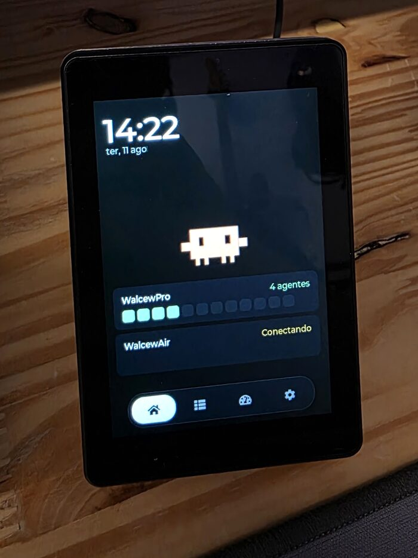
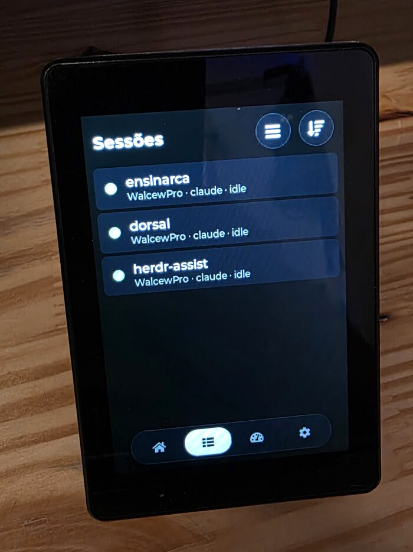
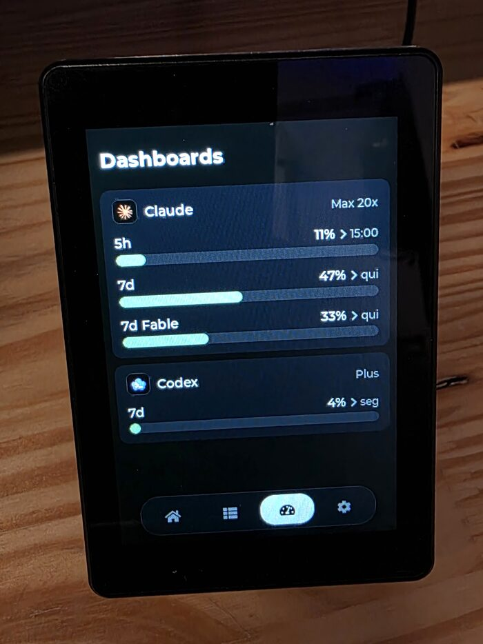
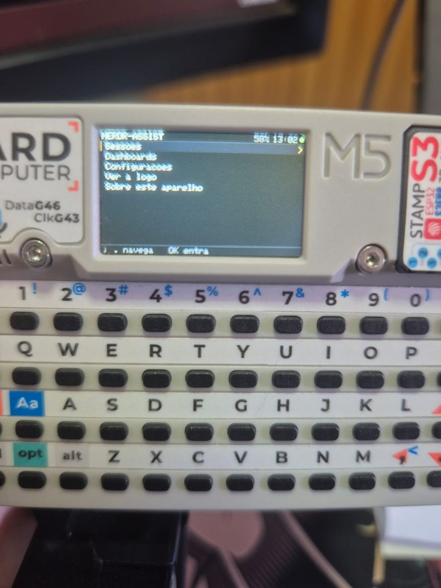
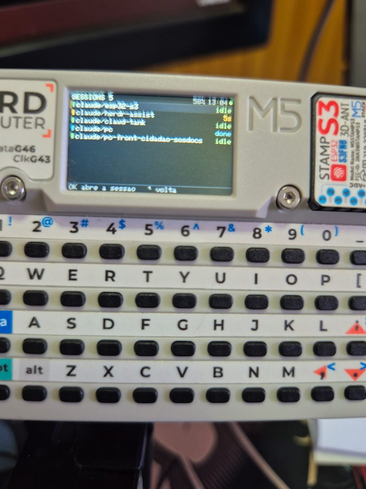
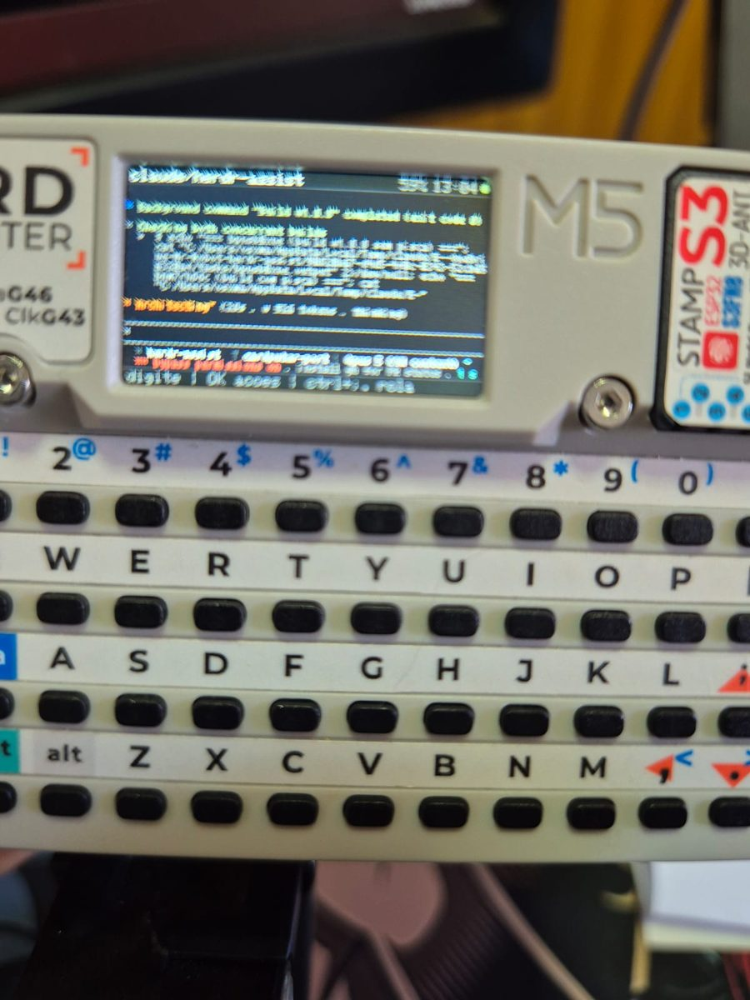

# herdr-assist

> 🇧🇷 **Este documento também existe em português:** [README.pt-BR.md](README.pt-BR.md)

A dedicated physical panel for monitoring and controlling [Herdr](https://herdr.dev)
sessions — the terminal multiplexer for coding agents. It runs on an ESP32-S3 kit with a
3.5" touch display and sits on your desk next to the keyboard: agents show up with their
state in color, and when one of them stops to ask for a decision the panel rings a bell
that opens the right session with a single tap, with no hunting for the window in your
terminal.

| Home | Sessions | Dashboards |
|:---:|:---:|:---:|
|  |  |  |
| Clock, mascot and a heatmap per host | Sessions with state, grouped by host | Claude and Codex usage limits |

> **Requires Herdr.** This panel is a client, not a standalone device — it needs a running
> [Herdr](https://herdr.dev) instance on every machine you want to monitor. The bridge in
> `plugin/` ships as a Herdr plugin and speaks its native socket, so everything the panel
> shows comes from Herdr's own event stream.

## Quick start

Three steps: flash the panel, install the bridge on the machine you want to control, and
pair the two. **No toolchain and no compiling** — the release ships prebuilt binaries.

### 1. Flash the panel

Download the latest binaries from the
[releases page](https://github.com/walcew/herdr-assist/releases/latest), plug the board
into USB, and write the image:

```sh
# esptool is the only requirement
pipx install esptool          # or: brew install esptool

# find the port — it changes with the USB socket you used
esptool.py chip_id            # macOS: /dev/cu.usbmodemXXXX, Linux: /dev/ttyACM0

esptool.py --chip esp32s3 --port /dev/cu.usbmodemXXXX \
    write_flash 0x0 herdr-assist-v0.5.0-install.bin
```

The panel reboots into the settings screen: pick your Wi-Fi network from the list and
type the password. Leave the hosts alone for now — step 3 fills them in for you.

> **Installing vs. upgrading.** The `-install.bin` image spans `0x0`–`0x10000`, which
> covers the NVS partition, so it **erases the panel config** (Wi-Fi, hosts, tokens,
> language). That is what you want on a fresh board — and the **required path when
> migrating from v0.4.0 or older**, whose partition table has no OTA slots.
>
> From v0.5.0 on the panel **updates itself**: Settings → Device → Update firmware,
> and a toast announces new releases (checked once a day). USB is only needed again
> if a panel cannot reach GitHub; in that case erase otadata first (so the bootloader
> boots the slot being written) and flash the app alone, keeping the config:
>
> ```sh
> esptool.py --chip esp32s3 --port /dev/cu.usbmodemXXXX erase_region 0xd000 0x2000
> esptool.py --chip esp32s3 --port /dev/cu.usbmodemXXXX \
>     write_flash 0x10000 herdr-assist-v0.5.0-update.bin
> ```

> **If a write keeps dropping mid-transfer, put the board in download mode
> first**: hold BOOT, tap RST, release BOOT (the screen stays dark — that is
> the point). A panel with no bootable app resets about once a second, and each
> reset re-enumerates the USB device, which can cut esptool off mid-write and
> leave the slot half-written — the failure feeds itself. In download mode the
> chip never resets on its own and the write runs to completion.

### 2. Install the bridge on the host

The bridge is a Herdr plugin. Run this on every machine you want to reach from the panel:

```sh
herdr plugin install walcew/herdr-assist/plugin            # registers and enables it
herdr plugin action invoke herdr-assist.restart-bridge     # start it right now
```

Herdr clones the repo, shows what the plugin declares, and starts the bridge with every
session from then on — the second command just skips waiting for the next one. The bridge
is pure Python stdlib: it works with the `python3` macOS ships (3.9+), with no toolchain.

To **upgrade** later, run the same two commands again: reinstalling replaces the managed
checkout and leaves the config directory (token, `env` overrides) untouched. To hack on
the plugin instead, `git clone` the repo and `herdr plugin link herdr-assist/plugin`.

### 3. Pair the panel

Typing 32 hex characters on a 3.5" touchscreen is not viable, so the direction is
reversed: **the host sends the finished config to the panel.**

1. On the panel: **Settings → Pair with a host**. It shows a 6-character code and starts
   announcing itself over UDP broadcast for 3 minutes.
2. On the host, inside any Herdr pane, open the admin screen and press `p`:
   ```sh
   herdr plugin pane open --plugin herdr-assist --entrypoint admin
   ```
3. Pick the code shown on the panel screen from the list.
4. Still in the admin screen, press `k` to install the `prefix+a` keyboard shortcut —
   from then on the screen opens without the command line (`ctrl+b`, then `a`).

The host sends name, address, port and token; the panel writes them to NVS and reboots
already connected. Nothing is typed on the touchscreen.

That's it — the panel now lists your sessions. The rest of this document is reference.

## Language

The interface speaks **English and Portuguese**, and the firmware is the same for both:
the language comes from NVS (**Settings → Device → Language**, which toggles on tap) and
takes effect on the next reboot, together with the rest of the config. A factory-fresh
panel boots in English. The admin screen on the host follows the machine locale (`LANG`
and friends, or `HERDR_ASSIST_LANG` to force it).

## Hardware

**JC3248W535EN** (Guition/Sunton), around US$ 25 on AliExpress:

| Component | Spec |
|---|---|
| MCU | ESP32-S3-WROOM-1 (240 MHz, 2 cores) |
| Memory | 8 MB PSRAM (OPI) + 16 MB flash |
| Display | 3.5" IPS 320×480, AXS15231B controller over QSPI |
| Touch | Capacitive, same AXS15231B, over I2C (SCL 8 / SDA 4) |
| Network | Wi-Fi 2.4 GHz + BLE |

Relevant pinout in `src/esp_bsp.h`; schematics and datasheets in `docs/`.

### Other boards: M5Stack Cardputer

`cardputer/` holds a port to the **M5Stack Cardputer** (240×135 plus a 56-key
keyboard), a separate PlatformIO project built on Arduino + M5GFX. It talks to
the same bridge, pairs the same way and shares the protocol modules with the
panel — and, having a keyboard, it answers agents with free text instead of the
allowlisted keys alone. See [`cardputer/README.md`](cardputer/README.md).


|  |  |  |
|:---:|:---:|:---:|

🎬 [Watch it running](https://youtube.com/shorts/AlCFoE3ng9Y)

## Architecture

Herdr exposes its API on a local unix socket, which a device on the network cannot reach.
The bridge (`plugin/herdr_bridge.py`, pure stdlib) translates that to TCP and nothing
else: it subscribes to Herdr's events, so the panel receives changes by **push**, with no
polling. It is packaged as a **Herdr plugin** (`plugin/herdr-plugin.toml`), which Herdr
starts along with the session — one plugin per machine you want to drive from the panel.

```
┌─ JC3248W535EN ─────────────┐     Wi-Fi / LAN      ┌─ Mac ───────────────────────┐
│ herdr-assist               │ ◄── TCP + JSON ───►  │ herdr-assist plugin (:9375) │
│ ESP-IDF 5.2 + LVGL 8.4     │    one message       │          │ unix socket      │
│ UI: list, terminal, actions│    per line          │          ▼                  │
└────────────────────────────┘ ◄── UDP discovery ─► │   herdr (events.subscribe)  │
                                  (:9375, auto)     └─────────────────────────────┘
```

**Panel → bridge:** `hello` (token, mandatory on the 1st line), then `read_pane` (which
also carries the panel screen geometry), `send_keys`, `send_text`, `focus`, `scroll_pane`,
`release_pane`, `ping`.
**Bridge → panel:** `agents` (state of all of them, including whoever is `blocked`),
`pane_content` (the terminal screen **with SGR/colors**, faithful to the host — only
trailing blank lines are stripped; the emulation is done by the Ghostty engine embedded in
Herdr, via `pane.read format:"ansi"`, and the panel only parses SGR and paints), `limits`
(AI provider usage limits for the Dash tab — collected from the Claude Code and Codex
usage endpoints using the credentials those CLIs keep refreshed in
`~/.claude/.credentials.json` and `~/.codex/auth.json`; no token leaves the Mac, only
percentages), `pong`.

**Windows.** From plugin 0.5.0 the bridge also runs on a Windows host. There
the Herdr socket is a named pipe whose *name* is the whole path
(`\\.\pipe\C:\Users\...\herdr.sock`), which Python cannot open — so the bridge talks to
Herdr through the CLI instead, and reconciles by polling rather than by
`events.subscribe`. Pairing is done with `plugin/pair.py`; the curses admin
screen stays macOS/Linux only.

The bridge is where the security decisions happen, because anyone on the LAN can reach
that port. **Every connection requires a token** (`hello` handshake on the first line;
without it the bridge disconnects in 5 s). On top of that: only keys from an allowlist get
through, text has a size cap, and commands only apply to panes that exist. The token is
generated on the plugin's first start (0600 in the config dir); the `Show panel token`
action in Herdr displays the value.

### Host discovery (auto mode)

DHCP moves hosts around, so a slot paired since plugin 0.4 stores **no IP at all**: the
panel finds the bridge by UDP broadcast (`herdr-find` → `herdr-here`, same port 9375) at
boot and whenever the connection drops, keeping the discovered address in RAM only. The
handshake proves possession of the token without ever putting it on the wire — the reply
carries `h = HMAC-SHA256(token, "nonce|ip|port|name")`, and the panel adopts the **signed**
ip/port, never the datagram sender, so a neighbor cannot redirect the panel by replaying
probes. Typing an address in the host editor turns discovery off for that slot (static
mode) — use it on networks that filter broadcast. Auto mode needs plugin ≥ 0.4 on the
host; discovery shares the pairing's requirements (same L2 segment, broadcast allowed)
and requires the default `BRIDGE_BIND` `0.0.0.0` (a specific bind address goes deaf to
broadcast).

## Using the admin screen

With the shortcut installed (press `k` in the screen itself, or see below): `ctrl+b`,
then `a`. From the command line, inside any Herdr pane:

```sh
herdr plugin pane open --plugin herdr-assist --entrypoint admin
```

The screen opens as a 76×22 popup over the session — a small TUI you can drive with
the mouse (click any row or button) or entirely from the keyboard: `p` pairs a panel,
`r` rotates the token, `x` restarts the bridge, `k` installs the keyboard shortcut,
arrows + enter navigate, `q`/esc closes. The status block refreshes on its own.

> Over SSH, `herdr` may not be on the PATH (a non-interactive session does not load the
> Homebrew environment): use the full path, usually `/opt/homebrew/bin/herdr`.

A keybinding is the way in, because Herdr 0.8.0 **has no UI surface for plugins** — no
menu, palette or picker lists plugin panes or actions, and plugins cannot ship default
keybindings (keys belong to the user's config, by design). Pressing `k` in the admin
screen sets this up for you: it appends the block below to `~/.config/herdr/config.toml`
(backup first), validates with `herdr config check` — rolling back on failure — and
applies it with `herdr server reload-config`. `prefix+a` is unbound in the stock 0.8.0
defaults; if your config already uses it, `k` refuses and you pick a key manually:

```toml
[[keys.command]]
key = "prefix+a"          # ctrl+b then "a"
type = "plugin_action"
command = "herdr-assist.admin"
description = "herdr-assist admin"
```

`herdr config check` validates and `herdr server reload-config` applies without a restart.

The same admin screen shows the bridge state, the token and the connected panels. From the
CLI, the token also comes out of:

```sh
cat "$(herdr plugin config-dir herdr-assist)/token"
```

The bridge log lives in `<state-dir>/bridge.log` — Herdr uses
`~/.local/state/herdr/plugins/<id>/`, which is not the config dir.

> The plugin also accepts optional config in `<config-dir>/env` (`BRIDGE_PORT`,
> `BRIDGE_BIND`) — the config dir comes out of `herdr plugin config-dir herdr-assist`.

## Building from source

Only needed if you are changing the firmware — to just use the panel, see
[Quick start](#quick-start).

Requires [PlatformIO](https://platformio.org/) (`pipx install platformio`). The ESP-IDF
toolchain downloads itself on the first build (~1 GB).

```sh
pio run                                        # build
pio device list                                # the port changes with the USB socket
pio run -t upload --upload-port /dev/cu.usbmodemXXXX
```

The firmware is generic — no credentials are compiled in. On first boot (or after erasing
NVS) the panel opens the settings screen: pick the Wi-Fi network from the list, type the
password, and register up to 4 Herdr hosts (name, IP or hostname, port and bridge
**token**). Everything lives in NVS and survives app reflashes; saving reboots the panel.

To regenerate the terminal font (only needed when changing glyph ranges):

```sh
./scripts/gen_font.sh
```

### Cutting a release

Push a `v*` tag and [the workflow](.github/workflows/release.yml) builds, merges the
install image and publishes the release with both binaries, their checksums and a
fixed-name `manifest.json` — the file panels poll (via `releases/latest/download/`)
to discover updates OTA:

```sh
git tag -a v0.5.0 -m "v0.5.0"
git push origin v0.5.0
```

The version baked into the binary comes from the tag (the workflow writes it to
`version.txt` before building), so the panel's `strcmp` against the manifest matches
exactly. Local builds fall back to `git describe`, which never equals a release tag —
a dev panel therefore always sees the current release as "available", which is handy
for testing the flow.

## Structure

| File | Role |
|---|---|
| `plugin/herdr-plugin.toml` | Herdr plugin manifest (startup, admin pane, actions) |
| `plugin/start.py` | Plugin startup: starts the bridge detached, idempotent, cross-platform |
| `plugin/pair.py` | Pairing from the command line, no curses — the Windows path |
| `plugin/herdr_bridge.py` | Bridge: Herdr socket ↔ TCP, token handshake, allowlist, sanitizing, usage-limit collection (Claude/Codex) |
| `plugin/admin.py` | Admin screen in Herdr: status, token, pairing, keybinding install |
| `plugin/i18n.py` | Admin screen strings (en/pt), language taken from the host locale |
| `src/pairing.c` | Panel pairing mode: broadcast announcement + config reception |
| `src/DEMO_LVGL.c` | Entry point: brings up panel, config, Wi-Fi, connections and UI |
| `src/panel_cfg.c` | Persistent config (NVS): Wi-Fi network + up to 4 Herdr hosts + language |
| `src/net.c` | Wi-Fi station with automatic reconnection and scanning for the config screen |
| `src/herdr_conn.c` | One TCP connection per host, protocol parsing, ping and reconnection |
| `src/herdr_model.c` | State shared between the network tasks and the UI task (mutex + generation) |
| `src/term_parse.c` | Pure SGR parser (no LVGL/ESP): ANSI snapshot → grid of colored runs; testable on a Mac (`scripts/term_parse_test.c`) |
| `src/term_view.c` | Custom widget for the terminal screen: draws the grid with per-run color/style, faithful horizontal pan |
| `src/i18n.c` | Interface strings (en/pt) in a single list that generates both enum and table |
| `src/ui_theme.c` | Palette, fonts, topbar and dock shared by the screens |
| `src/herdr_ui.c` | LVGL UI: home (clock, mascot, summary, heatmap), sessions, limits dash, terminal, actions, keyboard |
| `src/herdr_ui_settings.c` | Settings tab: Wi-Fi scan, password, host editor, language, firmware update |
| `src/fw_update.c` | OTA via GitHub Releases: daily manifest check, download with esp_https_ota, rollback confirm |
| `src/lv_font_terminal_12.c` | Generated font (do not edit) — see `scripts/gen_font.sh` |
| `src/esp_bsp.c`, `src/esp_lcd_axs15231b.c`, `src/lv_port.c` | Vendor BSP (display, touch, LVGL port) |

### Implementation notes

- **`full_refresh = 1`** (`lv_port.c`) is not an aesthetic choice, and it is expensive:
  307 KB per frame on the QSPI bus even when a single line of text changes. Two things
  prevent partial rendering on this panel. The first is known: the driver skipped RASET
  (0x2B) on QSPI ([esp-bsp#724](https://github.com/espressif/esp-bsp/issues/724)) — already
  fixed here. The second is not in the issue and was found the hard way: `draw_bitmap` uses
  **RAMWRC** (0x3C, "continue the previous write") whenever `y_start != 0`, ignoring the
  window it just defined. That works for sequential scanning, which is what full refresh
  does; with arbitrary areas, each region lands in the wrong place and the screen
  scrambles. Enabling partial also requires swapping that RAMWRC for RAMWR — untested.
- **Rotation is always done in software.** The panel ignores MADCTL, so runtime rotation
  does not work on any stack; `LVGL_PORT_ROTATION_DEGREE` in `DEMO_LVGL.c` settles it at
  compile time. The app uses 0° (native 320×480 portrait), which avoids the rotation copy
  in the flush — if the image comes out upside down on your stand, use 180°.
- **Touch is capacitive and needs no calibration** — what matters is remapping the
  coordinates according to rotation, done in `lv_port.c`.
- **Fonts**: none of the fonts shipping with LVGL work here — Montserrat and unscii cover
  only ASCII 0x20–0x7F, so box-drawing and spinners turn into empty rectangles, and labels
  like "Sessões" and "Endereço" lose their accents. Two families are generated: the
  terminal uses the whole JetBrainsMono Nerd (`scripts/gen_font.sh`) and the interface uses
  Montserrat with the full Latin-1, merged with LVGL's own FontAwesome so the `LV_SYMBOL_*`
  keep working (`scripts/gen_font_ui.sh`), plus typographic punctuation/arrows from
  Montserrat itself and `✓ ✗ ⚠ ●` from DejaVu Sans — symbols that reach the alerts in text
  coming from the terminal. The Nerd Font, even whole, does not cover everything Claude
  Code draws (spinner `✢✳✻✽`, `⏺ ⏵ ⏸ ⏳`, `◑ ◼ ✅ ✔ ⧉ ※` — audited against the cmap): those
  become visual neighbors the font does have (`⏺→●`, `✳→✶`, `✅→✓`...) in the `GLYPH_SWAPS`
  table of `replace_missing_glyphs()` — swapping in another font would break term_view's
  7 px grid, which assumes uniform advance.
- **The language is decided at boot and does not change at runtime.** The LVGL screens are
  built once in `herdr_ui_init()` and stay alive hidden — retranslating would mean
  destroying and rebuilding all of them, or storing the key of every label. Since changing
  network or hosts already reboots the panel, the language took the same path: the settings
  screen edits the copy, the toast warns that it is pending, and the reboot settles it.
  `i18n.h` holds a single X-macro list (`I18N_STRINGS`) from which both the key enum and
  the translation table are generated, so there is no case of adding a string in one
  language and forgetting the other — both translations live on the same line. The tables
  are `const char *const`: they live in flash (3.2 KB of rodata for both languages
  together, measured on the `.o`), and the only RAM cost is the `uint8_t` of the active
  language. pt_BR and en_US fit in the Latin-1 the UI fonts already cover, so nothing had
  to be regenerated. Left out of the bilingual scope, in fixed English: `herdr-plugin.toml`
  (the manifest is read by Herdr with no per-language field) and the two `start.py`
  messages the admin screen echoes when restarting the bridge — a shell script cannot
  follow the locale without carrying a table just for that, and English is the same
  criterion as the manifest.
- **The interface follows the "herdr-assist" project in Claude Design** — neutral palette
  (color only in status), topbar with no solid bar, and a floating four-tab dock. When
  changing the visuals, update it there too: `src/ui_theme.h` is the direct translation of
  those screens.
- **The terminal screen renders the real formatting** (`term_parse.c` + `term_view.c`): the
  bridge asks `pane.read` with `format:"ansi"` — Herdr's internal emulator is libghostty,
  which re-emits the screen as lines with SGR (SGR only: no cursor/OSC, confirmed on a real
  sample) — and the panel parses that into a grid of runs and draws it with
  `lv_draw_rect`/`lv_draw_label` on a 7×19 px cell (metrics from `lv_font_terminal_12`). No
  re-wrap: the grid stays at the pane's real width on the host, anchored vertically at the
  end with pan preserved between refreshes — horizontal pan still exists as a safety net
  for when the resolution lock (below) does not take. Caps: 220 columns × 48 lines × 12 KB
  (`HERDR_CONTENT_LEN`, matched to the bridge's cap of 12000). Accepted limitations: italic
  has no visual effect (single bpp1 font), bold becomes a lightened color (bright in the
  indexed palette, +30% white in truecolor), and emoji become `"* "` (2 cells, preserving
  alignment). An identical snapshot does not repaint: dedup by `seq` in the model avoids the
  307 KB full refresh for nothing.
- **A session opened on the panel runs at the panel screen's resolution.** Inheriting the
  host's ~135 columns forced you to drag the screen sideways to read anything, so
  `read_pane` carries the geometry that fits (`term_view_fit()`: 42 × 18) and the bridge
  locks the pane at that size while the panel is reading. Herdr's JSON API has no terminal
  size (`pane.resize` is a split ratio), so what does it is the
  `herdr terminal session control <pane_id> --cols N --rows M` CLI, which resizes the pty
  for real (TIOCSWINSZ) and keeps the size locked as long as the process lives. Releasing
  has three independent paths: `release_pane` when closing the detail, panel disconnection,
  and bridge death — in the last one the child sees EOF on stdin and detaches by itself,
  which is why its stdin is a pipe. Accepted consequence: while locked, that pane also
  shows up narrow in Herdr on the Mac, and every open/close makes the agent reflow.
- **Terminal scrolling is the host's, not the widget's.** Dragging vertically becomes
  `scroll_pane` → `terminal.scroll` with `source:"wheel"` on the controller, and from there
  Herdr decides: an app with mouse tracking (Claude Code) receives the event and scrolls its
  own content, otherwise the emulator scrollback moves. That is why `pane.read` uses
  `source:"visible"` — the viewport is what scrolling moves; with `"recent"` the panel would
  be stuck at the end. Two things that cost measurement: the pointer **position** goes along
  (the cell under your finger — with the wheel outside the transcript area Claude Code
  simply ignores it), and one dragged cell equals one line. LVGL's vertical axis is only
  released when the content does not fit (`term_view_set_ansi` toggles
  `LV_DIR_HOR`/`LV_DIR_ALL`), in which case the resolution lock failed and scrolling locally
  is the right thing.
- **A pending decision is a beacon, not a rebuilt form.** When an agent enters `blocked`, a
  red bell shows up on the home screen — on the clock line, on the opposite side — swinging
  until someone acts; tapping it opens the session that is waiting (with the session count
  in the label when there is more than one). Before this, the bridge tried to recognize the
  form with regex, sent the question and the detected options, and the panel built a modal
  with one button per option; answering made the bridge navigate the cursor with arrows and
  confirm. That came out whole: with the panel terminal already running at screen resolution
  and with scrolling, seeing the question as it is and answering with ↑/↓/Enter is more
  faithful than guessing it — and the class of error where the button did not match what was
  on screen disappears. What backs the beacon is the `agent_status` that `agents` already
  carried. Accepted consequence: the alert only exists on the home screen (the modal
  appeared over any screen).
- **The home clock depends on SNTP** (`net.c`), with the timezone fixed at UTC-3. Without
  syncing, the home shows `--:--` instead of an invented time.
- **Dead-connection detection** (`herdr_conn.c`): with push, silence is the normal state, so
  a drop cannot be inferred from the absence of data. The panel sends `ping` every 20 s and
  gives up on the connection after 50 s without an answer — this covers the case where TCP
  stays open but stops receiving (Wi-Fi that goes away, a Mac that sleeps), which would
  otherwise leave the panel stuck at "connecting" forever.
- **Large buffers live in static memory, never on the stack**: the LVGL task has 8 KB and
  the network one 6 KB, while a single terminal read is over 8 KB. Declaring those structs
  as local variables blows the stack and takes the device down with a corrupted backtrace.

## Credits and license

The BSP, the display/touch drivers and the LVGL port come from
[NorthernMan54's PlatformIO port](https://github.com/NorthernMan54/JC3248W535EN), which
packages the original vendor material (Shenzhen Jingcai / Guition). LVGL 8.4 is vendored in
`libraries/lvgl`, pruned of the demos and examples that do not enter the build.

The protocol design (the `agents` / `pane_content` types, and the `blocked` with detected
approval options, which existed here until the beacon replaced it) came from the
[herdr-remote](https://github.com/dcolinmorgan/herdr-remote) relay, used as a reference
before we swapped it for our own bridge speaking Herdr's native socket.

MIT — see `LICENSE`.
