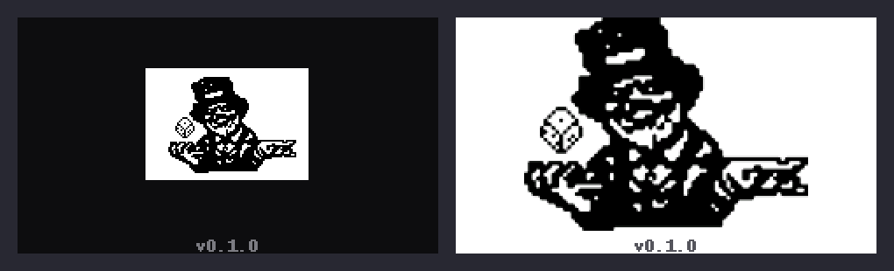

# Logo de boot do Cardputer — do selo de 93×64 ao desenho na tela toda

Handoff da mudança feita na tela de boot do firmware do Cardputer (M5Stack
Cardputer v1, ST7789 de 240×135).



*Esquerda: como estava. Direita: como ficou.*

---

## Resumo

A logo aparecia com 39% da largura da tela — um selo branco perdido no fundo
escuro. Agora ocupa 68% da largura e 90% da altura, com **3,3× a área** e as
bordas suavizadas.

A causa não era a arte: era o firmware ampliar por fator inteiro em tempo de
execução. A correção move a ampliação para a compilação e troca o formato do
asset de 1 bit para tons de cinza.

## O problema

`paint_logo()` escolhia a escala assim:

```c
int esc   = SCR_W / LOGO_BOOT_W;             /* 240 / 93  = 2 */
int esc_v = (SCR_H - reserva) / LOGO_BOOT_H; /* 122 / 64  = 1 */
if (esc_v < esc) esc = esc_v;                /* -> 1 */
```

A altura era o gargalo: 122/64 = 1,9, que truncado em inteiro vira **1**. A logo
desenhava em 93×64 numa tela de 240×135.

Subir para escala 2 não resolveria — 64×2 = 128 não cabe nos 122 úteis, e mesmo
que coubesse seria a mesma arte com os degraus duas vezes maiores.

## A solução

A ampliação saiu do firmware e foi para o `gen_logo.py`. O traço é reamostrado
com supersampling e corte em meio-tom, e o `.h` já sai no tamanho final:

1. recorta a fonte até o traço (93×64 → **73×55** de conteúdo real);
2. amplia 8× por vizinho mais próximo;
3. borra com gaussiana de σ = 0,6 px do alvo;
4. corta em 50% — isso recoloca a borda numa posição sub-pixel, e é o passo que
   vira curva onde havia degrau;
5. reduz ao tamanho final por média de área, o que transforma essa borda em
   tons intermediários.

O firmware não escala mais nada: só traduz cinza para RGB565, linha a linha.

### Por que não foi por outro caminho

| Tentativa | Resultado |
|---|---|
| Vizinho mais próximo 2× | Mantém a escada, só maior |
| Bicúbico direto | Fica mole e sujo; o traço perde o miolo |
| Contornos + `approxPolyDP` + `fillPoly` AA | Bom, mas preserva o caráter poligonal dos degraus |
| Borrão σ = 1,1 | Suave demais: o rosto vira mancha e os pontinhos do chapéu somem |
| **Borrão σ = 0,6 + corte** | **Escolhido** — curvas limpas mantendo os detalhes finos |

`potrace` resolveria isso melhor, mas não estava disponível; o caminho acima usa
só `opencv` + `numpy`, que já estavam.

## Arquivos alterados

| Arquivo | Mudança |
|---|---|
| `cardputer/scripts/gen_logo.py` | Reescrito: emite cinza com anti-alias no tamanho final, em vez de 1 bit no tamanho da fonte. Novo argumento `--altura`. |
| `cardputer/src/assets/logo_boot.h` | Regerado: 93×64 de 1 bit (768 B) → **162×122 em cinza** (19.764 B). |
| `cardputer/src/ui.cpp` | `paint_logo()` reescrito. Some o laço de corridas de bits e o cálculo de escala; entra a conversão cinza→RGB565 por linha. |

Nada mais no repositório toca essa arte: `logo_boot` só é referenciado por
`ui.cpp`, e o firmware do painel de 3,5" (`src/` na raiz) não usa esse asset.

## O formato novo do asset

```c
#define LOGO_BOOT_W 162
#define LOGO_BOOT_H 122

/* Um byte por pixel: 0 = tinta preta, 255 = papel branco.
   Já está no tamanho final; o firmware não escala. */
static const uint8_t logo_boot[19764] = { ... };
```

`LOGO_BOOT_STRIDE` **deixou de existir** — não há mais empacotamento de bits.
Se algum código fora daqui usava esse define, vai quebrar na compilação.

Custo: 19.764 bytes de flash contra os 768 do formato antigo, **+19 KB**. É o
preço do anti-alias — sem meio-tom não há curva. A mesma arte em RGB565 custaria
o dobro sem ganhar nada, porque é cinza puro; 4 bits por pixel cortaria pela
metade, mas 65 tons não cabem em 16 níveis sem faixear as bordas.

## O desenho na tela

O papel branco toma a **tela inteira**, em vez do cartão branco sobre fundo
escuro. Dois motivos:

- recortada no traço, a arte tem proporção 4:3 contra os 16:9 do display, então
  sobram ~39 px de cada lado de qualquer jeito;
- com o cartão, a borda direita cruzava a ponta da faixa e o desenho ficava com
  cara de arte cortada.

Isso significa **um flash de tela branca no boot** antes da UI escura entrar. Foi
uma escolha, não um descuido. Para voltar ao cartão, basta trocar

```c
d.fillScreen(TFT_WHITE);
```

de volta por `d.fillScreen(C_BG)` e repor o `fillRect` do papel atrás da arte.

A linha da versão continua nos 13 px de baixo, agora em `C_LOGO_VERSAO`
(`0x55555c`) — `C_MUTED` foi calibrado para fundo quase preto e sumiria no
branco.

### Se quiser o mascote ainda maior

Os 13 px reservados para a versão são o que limita a altura. Sem eles cabe
162×122 → **179×135**, cerca de 10% maior em cada eixo:

```powershell
python scripts/gen_logo.py assets/logo.png src/assets/logo_boot.h --altura 135
```

e chamar `paint_logo(false)` no `ui_splash()`. A versão continua visível em
Configurações.

## Como regenerar

```powershell
cd cardputer
python scripts/gen_logo.py assets/logo.png src/assets/logo_boot.h
```

Precisa de `opencv-python`, `numpy` e `Pillow`. Só é necessário quando a arte
muda; o `.h` vai versionado.

## Verificação feita

- **Build completo do PlatformIO: SUCCESS** (`pio run -e cardputer`).
  Flash em 38,0% (1.195.127 de 3.145.728 B), RAM em 27,3% (89.424 de 327.680 B).
- O header foi compilado com `gcc` rodando a mesma conversão cinza→RGB565 do
  `paint_logo`, e o resultado foi conferido contra uma implementação
  independente em Python: soma de verificação idêntica (`748169197`) e amostras
  de pixel iguais. O empacotamento 5/6/5 está certo.
- O `.h` foi validado: `sizeof(logo_boot) == LOGO_BOOT_W * LOGO_BOOT_H`.
- A tela de boot foi renderizada em mockup a partir do `.h` gerado, já com a
  quantização RGB565 aplicada, para conferir o resultado visual.

**Não foi gravado em hardware.** Ninguém viu isso rodando no display real — a
verificação é de build, de dados e de mockup.

## Limite conhecido da arte

A fonte tem 73×55 px de traço útil e não existe original em resolução maior no
repositório (a arte de origem vive em `cardputer/assets/logo.png`, dentro do projeto). O que foi
feito é suavizar e ampliar o que havia: **detalhe que não está na fonte não foi
inventado**. Se aparecer o desenho original em resolução maior, é só apontar o
`gen_logo.py` para ele e regerar — nada no firmware precisa mudar, porque ele lê
`LOGO_BOOT_W`/`LOGO_BOOT_H` do próprio header.

## Rollback

Reverter os três arquivos citados. O formato antigo era 1 bit por pixel, MSB
primeiro, com `LOGO_BOOT_STRIDE = (W + 7) / 8`, e o `paint_logo` pintava
corridas horizontais de bits com `fillRect` sobre um `fillRect` branco.

## Estado no git

Nada foi commitado. Na árvore atual o diretório `cardputer/` inteiro ainda está
sem rastreamento (`?? cardputer/`), incluindo a arte de origem em `cardputer/assets/logo.png`.
