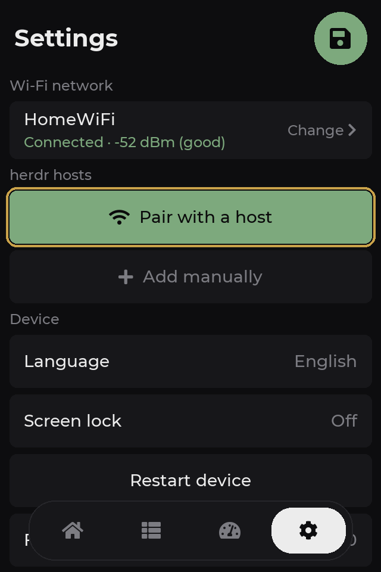
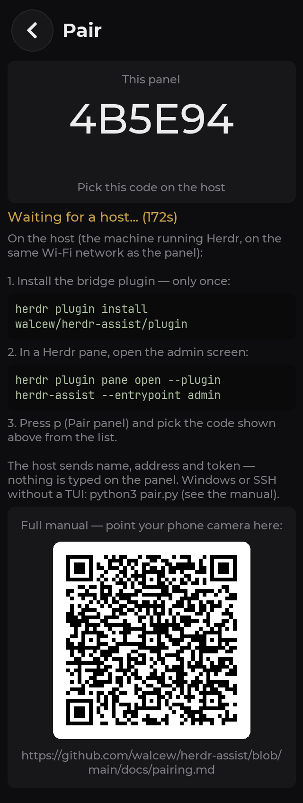

# Pairing manual

> 🇧🇷 **Este manual também existe em português:** [pairing.pt-BR.md](pairing.pt-BR.md)
>
> This is the guide the QR code on the panel's **Pair** screen opens.

Pairing connects the panel to a machine running [Herdr](https://herdr.dev)
(the *host*). Typing a 32-character token on a 3.5" touchscreen would be
unreasonable, so the flow is reversed: **the panel announces itself on the
network and the host sends the ready-made configuration** — name, address,
port and token. Nothing is typed on the panel.

## What you will need

- The panel **flashed and powered** — if you haven't flashed it yet, see
  [Flash the panel](../README.md#1-flash-the-panel).
- The panel **connected to Wi-Fi** (Settings → Wi-Fi network).
- A machine with **Herdr installed and running** (macOS, Linux or Windows).
- Panel and host **on the same local network**: pairing relies on UDP
  broadcast, which does not cross VLANs or guest networks.

## 1. Install the bridge on the host

The bridge is a Herdr plugin — it is what the panel talks to over the network.
Once per machine you want to monitor:

```sh
herdr plugin install walcew/herdr-assist/plugin            # registers and enables
herdr plugin action invoke herdr-assist.restart-bridge     # starts it right away
```

The second command just saves you from waiting for the next session — from
then on the bridge starts together with Herdr. It is pure-stdlib Python: the
stock macOS `python3` (3.9+) is enough, no toolchain.

## 2. Put the panel in pairing mode

On the panel: **Settings → Pair with a host** (the green row).



The pairing screen shows **this panel's code** (6 characters, derived from the
MAC address) and starts announcing itself over broadcast for **3 minutes**.
The same screen summarizes these steps and carries the QR code that points to
this manual:



> If you see **"No Wi-Fi: connect to a network first"**, fix Wi-Fi first —
> without a network the announcement goes nowhere. The mode stays on: as soon
> as Wi-Fi connects, the announcement starts reaching the network by itself.

## 3. On the host, send the configuration

From inside any Herdr pane, open the plugin's admin screen:

```sh
herdr plugin pane open --plugin herdr-assist --entrypoint admin
```

(With the shortcut installed — press `k` on that screen — it is just `ctrl+b`,
then `a`.)

Press **`p` (Pair panel)**. The host starts listening for announcements and
lists every panel it finds:

```text
  Pair panel

  On the panel: Settings → Pair with a host

  listening... 1 found — esc cancels

   1) 4B5E94   192.168.1.87

  check the code shown on the panel screen
```

Check that the listed code matches the one on the panel screen and select it
(click, `enter` or the number). The host sends the configuration; the panel
confirms **"Paired with …"**, saves it and **restarts already connected** —
your sessions show up in the Sessions tab.

### Windows, or SSH without a TUI

The admin screen is `curses`-based and exists only on macOS and Linux. On
Windows (or in a TUI-less SSH session), the same protocol lives in `pair.py`:

```sh
python3 pair.py              # listens, lists panels and asks
python3 pair.py --id 4B5E94  # pairs straight with that panel
```

The script sits in the plugin directory (the checkout created by
`herdr plugin install`).

> The M5Stack Cardputer port pairs exactly the same way — same bridge, same
> flow, only the device screen differs.

## Manual setup (networks that filter broadcast)

If the panel never shows up on the host's list — a VLAN between panel and
host, AP isolation, a corporate network — register without discovery:
**Settings → Add manually**, filling in:

| Field | Value |
|---|---|
| Name | Any label (e.g. `mac`) |
| Address | Host IP or hostname |
| Port | `9375` (bridge default) |
| Token | 32 hex — see below |
| Auto discovery | **off** (a typed address is static) |

The token comes from the host, either way:

```sh
cat "$(herdr plugin config-dir herdr-assist)/token"        # via CLI
herdr plugin action invoke herdr-assist.show-token          # via the plugin action
```

Typing 32 hex on a touchscreen is tedious — that is exactly what automatic
pairing avoids. Use manual setup only when broadcast cannot reach the host.

## How it works (and what it does not do)

- With the mode on, the panel announces `{"t":"herdr-assist","id","port"}`
  over UDP broadcast and accepts **one** configuration over TCP on port 9376,
  for up to 180 s. Outside that window nothing is listening.
- The host replies with name, address, port and token; the panel validates,
  saves to NVS and restarts. The panel keeps **one token per host** (up to 4
  hosts).
- Paired through the automatic flow, the slot stays in **auto mode**: no IP is
  stored — the panel finds the bridge via broadcast on every boot or drop, so
  DHCP handing the host a new IP breaks nothing. A hand-typed address turns
  discovery off for that slot.
- **Re-pairing the same machine does not duplicate it**: the slot is matched
  by host name, and the new configuration replaces the old one.

## Troubleshooting

| Symptom | Likely cause | What to do |
|---|---|---|
| The panel never shows up on the host's list | Different networks, VLAN/AP isolation, filtered broadcast | Put both on the same network; if it persists, use [manual setup](#manual-setup-networks-that-filter-broadcast) |
| "No Wi-Fi: connect to a network first" on the panel | Panel has no network | Settings → Wi-Fi network; then go back to pairing |
| "no token — start the bridge before pairing" on the host | The bridge never started (the token is created on first start) | `herdr plugin action invoke herdr-assist.restart-bridge`, or press `x` on the admin screen |
| macOS firewall asks whether `python3` may accept connections | Pairing listener blocked | Allow it — otherwise announcements never arrive |
| "Window closed" on the panel | The 3 minutes ran out | Go back and tap Pair again |
| "No room: remove a host before pairing" | All 4 slots are taken | Settings → tap a host → Remove |
| Paired, but the host stays Offline | Token rotated after pairing, or a static IP that changed | Pair again (it updates the slot); prefer auto mode for dynamic IPs |
| "the panel rejected the configuration" on the host | Panel firmware too old for the payload | Update the panel (Settings → Update firmware) and pair again |

## Rotating the token

**Rotate token** (`r` on the admin screen) generates a new token and restarts
the bridge — **every panel paired with that host stops connecting until it is
paired again**. Use it when you suspect the token leaked.

---

Back to the [README](../README.md#3-pair-the-panel).
