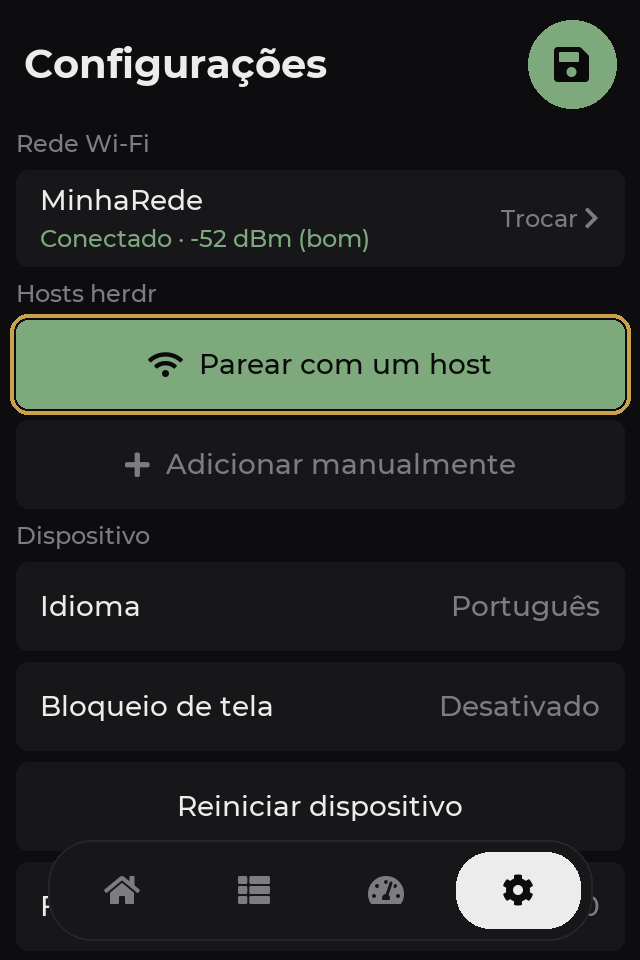
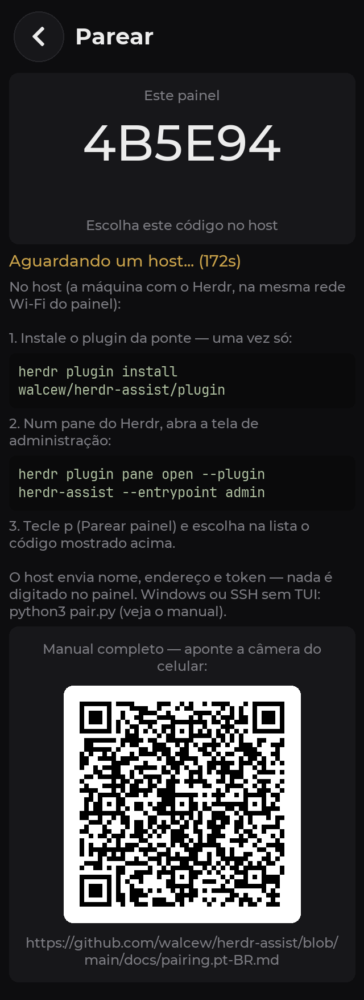

# Manual de pareamento

> 🇺🇸 **This guide is also available in English:** [pairing.md](pairing.md)
>
> Este é o manual que o QR code da tela **Parear** do painel abre.

Parear é conectar o painel a uma máquina que roda o [Herdr](https://herdr.dev)
(o *host*). Digitar um token de 32 caracteres num touch de 3,5" seria inviável,
então o sentido se inverte: **o painel se anuncia na rede e o host envia a
configuração pronta** — nome, endereço, porta e token. Nada é digitado no painel.

## O que você vai precisar

- O painel **gravado e ligado** — se ainda não gravou, veja
  [Gravando o painel](../README.pt-BR.md#1-gravando-o-painel).
- O painel **conectado ao Wi-Fi** (Configurações → Rede Wi-Fi).
- Uma máquina com o **Herdr instalado e aberto** (macOS, Linux ou Windows).
- Painel e host **na mesma rede local**: o pareamento usa broadcast UDP, que
  não atravessa VLANs nem redes de convidado.

## 1. Instale a ponte no host

A ponte é um plugin do Herdr — é ela que o painel acessa pela rede. Uma vez só,
em cada máquina que você quiser monitorar:

```sh
herdr plugin install walcew/herdr-assist/plugin            # registra e habilita
herdr plugin action invoke herdr-assist.restart-bridge     # sobe agora mesmo
```

O segundo comando só evita esperar a próxima sessão — dali em diante a ponte
sobe junto com o Herdr. Ela é Python puro de stdlib: o `python3` de fábrica do
macOS (3.9+) basta, sem toolchain.

## 2. Coloque o painel em modo de pareamento

No painel: **Configurações → Parear com um host** (a linha verde).



A tela de pareamento mostra o **código deste painel** (6 caracteres, derivado
do endereço MAC) e passa a se anunciar por broadcast durante **3 minutos**. A
mesma tela resume estes passos e traz o QR code que aponta para este manual:



> Se aparecer **"Sem Wi-Fi: conecte a uma rede antes"**, resolva o Wi-Fi
> primeiro — sem rede o anúncio não sai. O modo continua ligado: assim que o
> Wi-Fi conectar, o anúncio passa a alcançar a rede sozinho.

## 3. No host, envie a configuração

De dentro de qualquer pane do Herdr, abra a tela de administração do plugin:

```sh
herdr plugin pane open --plugin herdr-assist --entrypoint admin
```

(Com o atalho instalado — tecla `k` na própria tela — basta `ctrl+b`, depois
`a`.)

Tecle **`p` (Parear painel)**. O host passa a escutar os anúncios e lista cada
painel que encontrar:

```text
  Parear painel

  No painel: Configurações → Parear com um host

  escutando... 1 encontrado(s) — esc cancela

   1) 4B5E94   192.168.1.87

  confira o código mostrado na tela do painel
```

Confira que o código listado é o mesmo da tela do painel e selecione (clique,
`enter` ou o número). O host envia a configuração; o painel confirma
**"Pareado com …"**, grava e **reinicia já conectado** — as sessões aparecem
na aba Sessões.

### Windows ou SSH sem TUI

A tela de administração é `curses` e só existe no macOS e no Linux. No Windows
(ou numa sessão SSH sem TUI), o mesmo protocolo está no `pair.py`:

```sh
python3 pair.py              # escuta, lista os painéis e pergunta
python3 pair.py --id 4B5E94  # pareia direto com esse painel
```

O script fica no diretório do plugin (o checkout que o
`herdr plugin install` criou).

> O porte para M5Stack Cardputer pareia do mesmo jeito — mesma ponte, mesmo
> fluxo, só muda a tela do aparelho.

## Cadastro manual (redes que filtram broadcast)

Se o host nunca aparece na lista — VLAN entre painel e host, isolamento de AP,
rede corporativa — cadastre sem descoberta: **Configurações → Adicionar
manualmente**, preenchendo:

| Campo | Valor |
|---|---|
| Nome | Um rótulo qualquer (ex.: `mac`) |
| Endereço | IP ou hostname do host |
| Porta | `9375` (padrão da ponte) |
| Token | 32 hex — veja abaixo |
| Descoberta automática | **desligada** (endereço digitado é fixo) |

O token sai do host, por qualquer um dos caminhos:

```sh
cat "$(herdr plugin config-dir herdr-assist)/token"        # pela CLI
herdr plugin action invoke herdr-assist.show-token          # pela ação do plugin
```

Digitar 32 hex no touch é chato — é exatamente o que o pareamento automático
evita. Use o cadastro manual só quando o broadcast não alcança o host.

## Como funciona (e o que ele não faz)

- Com o modo ligado, o painel anuncia `{"t":"herdr-assist","id","port"}` por
  broadcast UDP e aceita **uma** configuração por TCP na porta 9376, por até
  180 s. Fora dessa janela não há nada aberto.
- O host responde com nome, endereço, porta e token; o painel valida, grava na
  NVS e reinicia. O painel guarda **um token por host** (até 4 hosts).
- Pareado pelo fluxo automático, o slot fica em **modo auto**: nenhum IP é
  gravado — o painel encontra a ponte por broadcast a cada boot ou queda, então
  DHCP trocar o IP do host não derruba nada. Endereço digitado à mão desliga a
  descoberta naquele slot.
- **Reparear a mesma máquina não duplica**: o slot é casado pelo nome do host,
  e a configuração nova substitui a antiga.

## Problemas comuns

| Sintoma | Causa provável | O que fazer |
|---|---|---|
| O painel não aparece na lista do host | Redes diferentes, VLAN/isolamento de AP, broadcast filtrado | Coloque os dois na mesma rede; persistindo, use o [cadastro manual](#cadastro-manual-redes-que-filtram-broadcast) |
| "Sem Wi-Fi: conecte a uma rede antes" na tela do painel | Painel sem rede | Configurações → Rede Wi-Fi; depois volte ao pareamento |
| "sem token — suba a ponte antes de parear" no host | A ponte nunca subiu (o token é gerado na primeira subida) | `herdr plugin action invoke herdr-assist.restart-bridge`, ou tecle `x` na tela de administração |
| Firewall do macOS pergunta se o `python3` pode receber conexões | Escuta do pareamento bloqueada | Permita — sem isso os anúncios não chegam |
| "Janela encerrada" no painel | Passaram-se os 3 minutos | Volte e toque em Parear de novo |
| "Sem espaço: remova um host antes de parear" | Os 4 slots estão ocupados | Configurações → toque no host → Remover |
| Pareou, mas o host segue Offline | Token girado depois do pareamento, ou IP fixo que mudou | Repareie (atualiza o slot); prefira o modo auto para IP dinâmico |
| "o painel recusou a configuração" no host | Firmware do painel antigo demais para o payload | Atualize o painel (Configurações → Atualizar firmware) e repareie |

## Girar o token

**Girar token** (tecla `r` na tela de administração) gera um token novo e
reinicia a ponte — **todos os painéis pareados com esse host param de conectar
até serem pareados de novo**. Use quando suspeitar que o token vazou.

---

Voltar ao [README](../README.pt-BR.md#3-pareando-o-painel).
